# Galleriet - Buy original paintings online

This is my fifth and final project with Code Institute. Galleriet is a B2C (Business to Customer) e-commerce application which sells paintings online. This application has been created using the Django framework. It is targeted towards individual customers that are interested in art and want to purchase original paintings from the best emerging artists around the world.

This project is for educational purposes only!

[View the live project here.](https://galleriet-mittnamnkenny.herokuapp.com/)

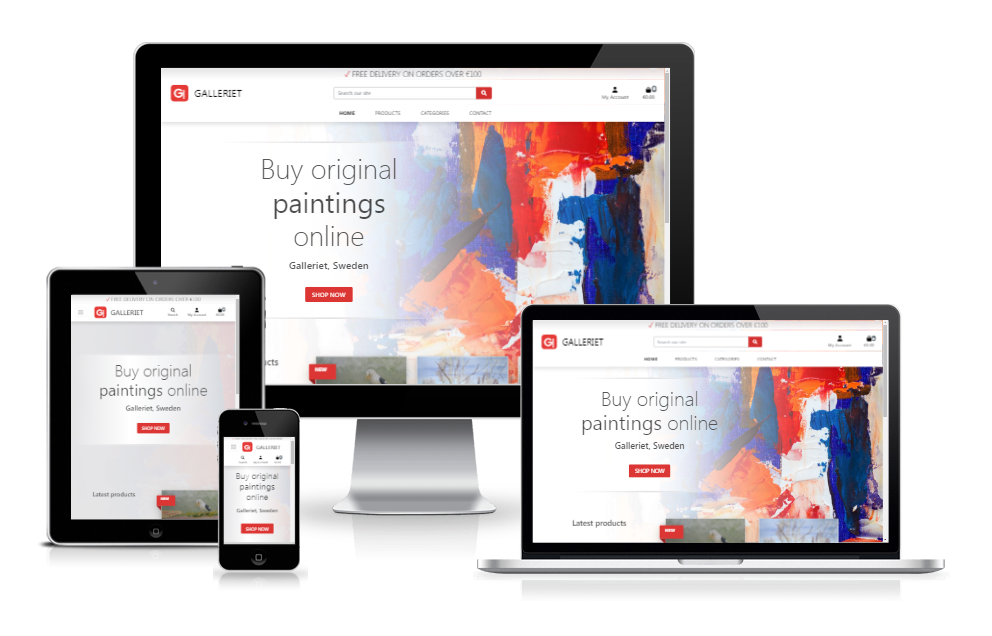

## Index – Table of Contents
* [User Experience (UX)](#user-experience-ux)
  * [Project Goals:](#project-goals)
  * [Strategy:](#strategy)
  * [User stories:](#user-stories)
* [Features](#features)
  * [Existing Features](#existing-features)

## User Experience (UX)

### Project Goals:

The primary goal for this project is to create a fully functional and easy-to-use e-commerce store that allow users to browse a number of different products to add to their shopping bag, so that they can checkout securely using Stripe online payment processing system and complete a purchase.

**Stripe test card:**
  - test card number 4242 4242 4242 4242, 
  - a random three-digit CVC number, 
  - and any expiration date in the future.

Please note: The website is for educational purposes only and uses Stripe test mode to simulate payments.

A user should be able to register to the site and store their personal information, such as default delivery information and view their past order history. They should also be presented with the option to contact store admin, subscribe to a newsletter provided by Mailchimp, and visit Galleriet's Facebook business page so that they can stay up to date with all the latest news.

Site administrator should have full CRUD functionality over available products directly from the site, so that they can Create, Read, Update and Delete products without any delays, and that any changes made on the site are directly reflected to the user.

A full description of all available functionality is included in this file.

### Strategy:

An Agile methodology was used to plan this project. This was implemented using a Kanban board in GitHub Project with linked Issues. To cover the goals of this project, a total of 6 Epics where created, which were then further developed into 26 User Stories, each with their own acceptance criterias and tasks to complete. Labels where then used to prioritize the importance of each User Story.

The following labels were used in this project and the distribution of user stories by label are:

  - Must-Have: 14/26
  - Should-Have: 9/26
  - Could-Have: 3/26

For more information: [View the Kanban Board here.](https://github.com/users/mittnamnkenny/projects/2/views/1)

### User stories:

  - #### EPIC Admin and Store management
    - US1. Add products:
      - As a **Site Admin** I can **add products directly from the site** so that **I can add new items to my store**
    - US2. Update products:
      - As a **Site Admin** I can **update products directly from the site** so that **I can change product prices, descriptions, images, and other product criteria**
    - US3. Delete products:
      - As a **Site Admin** I can **delete products directly from the site** so that **I remove items that are no longer for sale**
  
  - #### Registration and User accounts
    - US4. Account registration:
      - As a **Site User** I can **register an account** so that **I can have a personal account and be able to view my profile**
    - US5. Login/Logout:
      - As a **Site User** I can **login or logout** so that **I can access my personal account information**
    - US6. Password reset:
      - As a **Site User** I can **easily reset my password in case I forget it** so that **I can recover access to my account**
    - US7. Personalized profile:
      - As a **Site User** I can **have a personalized profile** so that **I can view my personal order history and order confirmations, and save my payment information**

  - #### Navigation and Interaction
    - US8. View products:
      - As a **Site Shopper** I can **view a list of products** so that **I can select some to purchase**
    - US9. Product detail:
      - As a **Site Shopper** I can **view individual product details** so that **I can identify the price, description, product image etc**
    - US10. View total:
      - As a **Site Shopper** I can **easily view the total of my purchase at any time** so that **I can avoid spending too much**
    - US11. Sort list:
      - As a **Site Shopper** I can **sort the list of available products** so that **I can easily identify the best priced and categorically sorted products**
    - US12. Search product:
      - As a **Site Shopper** I can **search for a product** so that **I can find a specific product I’d like to purchase**
    - US13. System messages:
      - As a **Site User** I will **get system messages when I interact with the site** so that **I get feedback when certain actions are completed**

  - #### Purchasing and Checkout
    - US14. Product purchase:
      - As a **Site Shopper** I can **easily select a product to purchase** so that **I can continue browsing the site and viewing more products**
    - US15. Shopping bag:
      - As a **Site Shopper** I can **view items in my bag to be purchased** so that **I can identify the total cost of my purchase and all items I will receive**
    - US16. Payment:
      - As a **Site Shopper** I can **easily enter my payment information** so that **I can check out quickly with no hassles, and feel that my personal and payment information is safe and secure**
    - US17. Order confirmation:
      - As a **Site Shopper** I can **view an order confirmation after checkout** so that **I can verify that my purchase was successful and I haven’t made any mistakes**

  - #### Contact, Web Marketing and SEO
    - US18. Contact page:
      - As a **Site User** I can **contact site admin** so that **I can get my questions answered or provide feedback**
    - US19. Newsletter:
      - As a **Site User** I can **subscribe to a newsletter** so that **I can get email informing me about new products and any changes made to the site**
    - US20. Facebook page:
      - As a **Site User** I can **access the store’s Facebook business page** so that **I can view posts and updates made on Facebook and interact**
    - US21. SEO:
      - As a **Site User** I can **easily find the site using popular search engines** so that **I can take advantage of what the site has to offer**

  - #### UX, UI, ETC
    - US22. Responsive:
      - As a **Site User** I can **use the site on the following platforms: desktop, laptop, tablet and smartphone** so that **I can access all functionality**
    - US23. Design:
      - As a **Site User** I can **get an overall positive impression based on the principles of user experience design, accessibility and responsivity** so that **I can quickly determine the purpose of the site and enjoy using it**
    - US24. Favicon:
      - As a **Site User** I am **presented with a favicon** so that **I can get a better experience when browsing with multiple tabs**
    - US25. GitHub:
      - As a **Site User** I am **presented with a link to mittnamnkenny’s GitHub** so that **I can view more repositories**
    - US26. 404 page:
      - As a **Site User** I am **presented with a custom 404 page when trying to access a URL that does not exist** so that **I can get an proper error page and easily return to the home page**

## Features

### Existing Features

#### Header:

The header is present on all pages of the site. It uses bootstrap's built-in class fixed-top, so when the user scrolls, it will remain fixed to the top of the browser's viewport and always visible to the user.

On the left-hand side of the header the user is presented with the logo; Galleriet with a styled Font Awesome icon (fa-solid fa-g), which when clicked will redirect the user to the home page. On mobile devices, the logo is centered.

The main navigation is featured in the header with the following links to: Home, Products, Categories, and Contact. Using request path and highlighting the current page in bold text.

My account and the Shopping bag is always visible to the user. The shopping bag will display the number of products added and the total price, automatically updating when new products added. Depending on your login status, the following links can be accessed using a drop-down menu under My account:

  - Not logged in: Register, Login
  - Logged in: My Profile, Logout and (if superuser) Product management

The header also features a search bar that allows the user to search for products and a delivery banner displaying the free delivery message. 

The header is fully responsive, so when on smaller devices the header will collapse and the main navigation links are accessed using a ”hamburger menu”.

View collapsed navbar:

#### Home page:

##### Home page - Callout:

Positioned at the top of the home page, this is first presented to the user as they visit the site. It includes a background image featuring an abstract painting photo.

A large text overlay; Buy original paintings online Galleriet, Sweden with an included link that will redirect the user to the products page.

On smaller screen sizes a dark background colour is positioned above the image so the text will stand out more and be easier to read. The text is also centered.

When the user visits the site for the first time, they will clearly see that this site is selling paintings.

##### Home page - Latest products:

Positioned below the callout, the user can view the most recent products available for purchase. This is featured on the home page so that the user can quickly see any product updates.

The user can view the latest products with information including: Product image, name, price, category, and artist.

By clicking on the product image, the user is redirected to the product detail page. The user can also click on the artist name or category to find matching products.

#### Products page:

The Products page will present a paginated list of all products on the site, limited to a maximum of eight products per page. The Products page can easily be accessed using the provided link on the Home page or in the main navigation; Products and Categories, alternatively by searching for a product name or description using the search bar.

The user will be able to view the number of products and sort products by price, name or category using the included drop-down field; Sort by.

Category buttons will be presented at the top of the page when the user chooses Categories in the main navigation. This will allow the user to easily switch between certain categories.

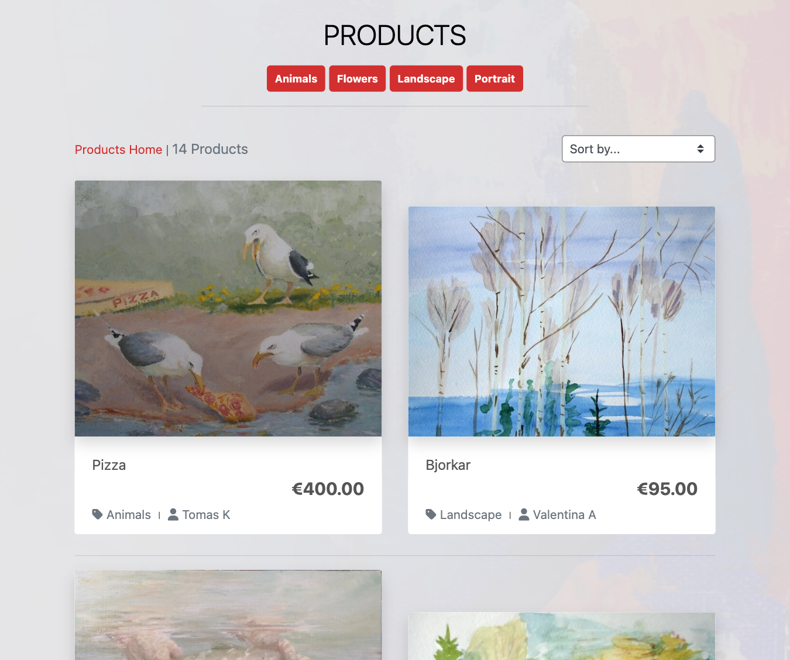

For each product the following information is presented to the user: Product image, name, price, category, and artist.

By clicking on the product image, the user is redirected to the product detail page. The user can also click on the artist name or category to find matching products.

#### Product detail page:

When a user chooses to click on a product, they are brought to the Product detail page. The user is shown the entirety of the product. The following information will be presented to the user: Product image, name, price, category, artist, description, medium, height and, width.

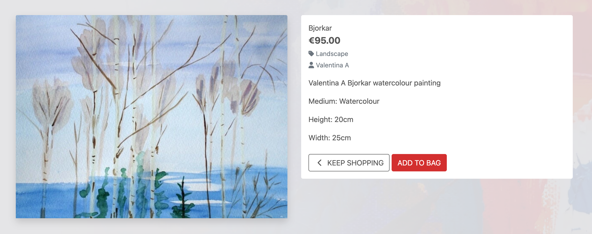

The user will be able to add the product to the shopping bag or return to the Products page using the clearly labeled buttons. The user can also click on the artist name or category to find matching products.

#### Shopping bag:

A user can easily access the Shopping bag by clicking on the shopping bag icon in the header section or when adding a new product using the; Go to secure checkout button in the success message displayed to the user.

On the Shopping bag page the user is presented with a summary of all products added for purchase and the grand total price. As new products are added to the shopping bag, the grand total is automatically updated, taking into consideration any delivery costs.

The user will be able to remove unwanted products from their shopping bag by clicking on Remove, before proceeding to the checkout page.

From this page the user can also choose to return to the Products page by clicking on the Keep shopping button.

Shopping bag on mobile devices:

#### Checkout page:

When a user clicks on Secure checkout on the Shopping bag page, the user is redirected to the Checkout page; this is the last step before completing a purchase. On the Checkout page the user is presented with an Order Summary and the user is required to enter their details, delivery information and payment credit card number. 

The option to Save this delivery information to my profile is presented to logged-in users; this allows the delivery form fields to be pre-populated on future purchases, which results in a faster checkout process.

From this page the user can also choose to return to the Shopping bag page by clicking on the Adjust bag button.

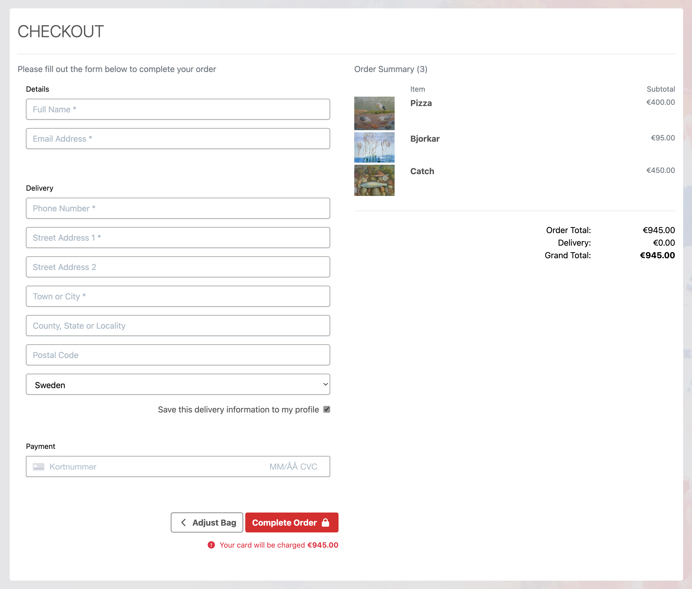

Checkout page on mobile devices:

All payments are handled by Stripe online payment processing system, and webhooks are implemented to ensure that all transactions are handled correctly in case of any problems during the payment process.

**Stripe test card:**
  - test card number 4242 4242 4242 4242, 
  - a random three-digit CVC number, 
  - and any expiration date in the future.

Please note: The website is for educational purposes only and uses Stripe test mode to simulate payments.

Stripe events example:

Stripe webhooks example:

#### Checkout success page:

The user is redirected to the Checkout success page when a purchase is completed, here the user is presented with a confirmation message and order information.

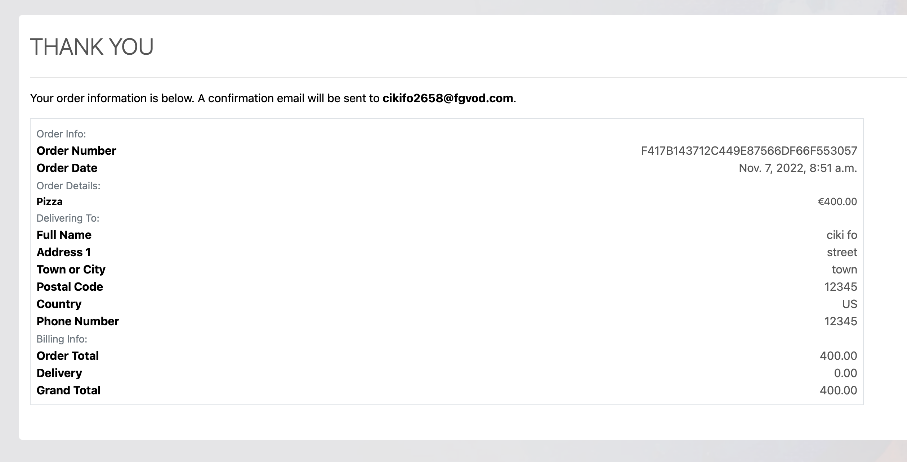

The user will receive an order confirmation email.

temp-mail.org was used when completing this purchase:

#### Profile page:

A user can easily access the Profile page from the header section using the drop-down menu under my account name. It is required that the user is registered and logged in.

The Profile page contains the users Default Delivery Information. A user can easily update their details by changing the pre-populated form fields and clicking on the Update Information button.

Order history is also presented to the user, here the user can view all their past orders and will be able to click on order number and check individual orders for full order information.

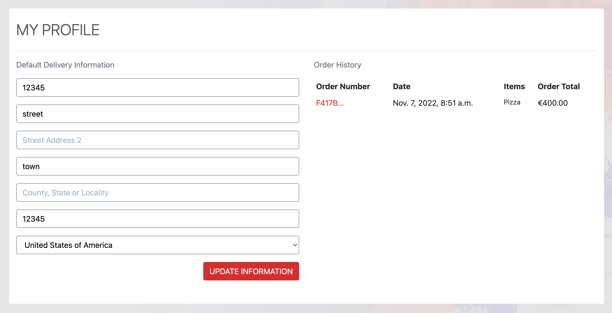

Profile page on mobile devices:

#### Register / Sign up page:

Unregistered users will be able to access the Register page by navigating to the header section and using the drop-down menu under My account. A new account can easily be created on the register page; the user needs to provide the following information: email, username and password.

The user is required to verify their email address after clicking on the Sign up button; an email will be automatically sent to the users email address.

temp-mail.org was used when registering this user:

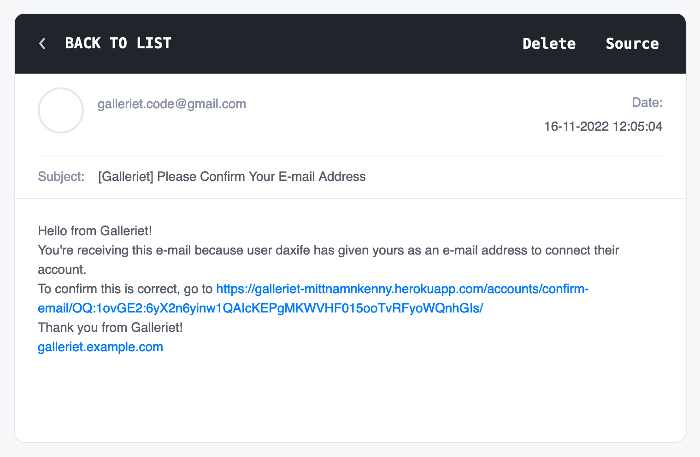

Confirm Email address:

#### Login / Sign in page:

When a user has completed the registration process, they can easily login to the site using the Sign in page. The Sign in page can be accessed in the header section using the drop-down menu under My account. To login the user is required to enter their username or email and the correct password.

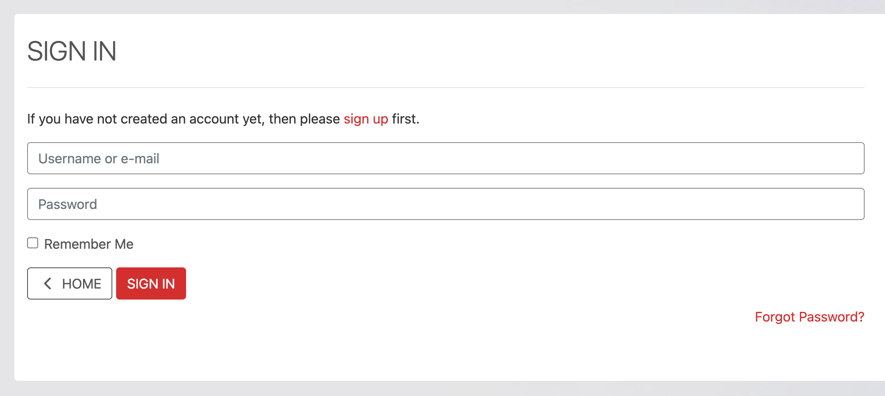

A user can also reset their password in case they forget it, using the link Forgot Password?

After clicking on Reset my password:

temp-mail.org was used when resetting the password for this user:

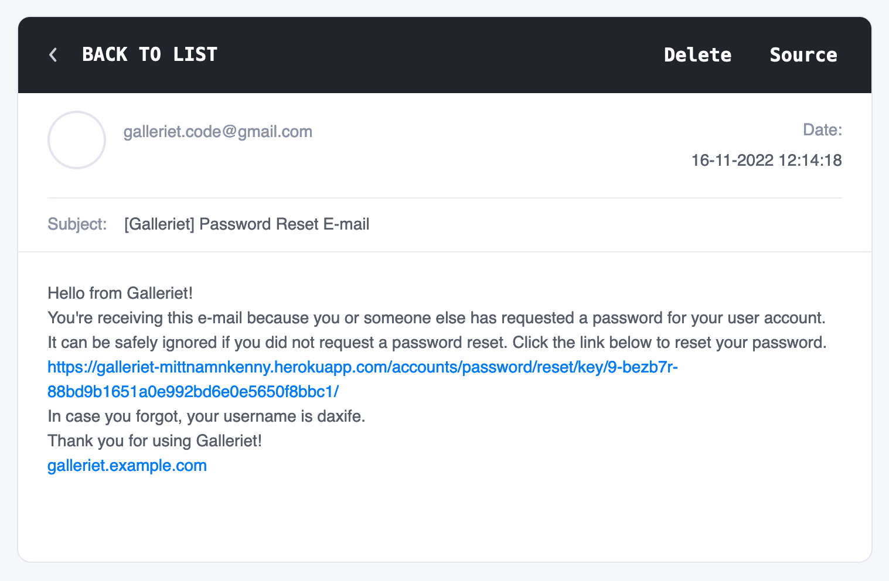

Enter new password:

Password change confirmation:

#### Logout / Sign out page:

The Sign out page can be accessed in the header section using the drop-down menu under My account name.

The user will have to confirm before singing out. When the user clicks on Sign out, they are directly logged out of their account and redirected to the Home page. If the user chooses to click the Cancel button instead, the user will be redirected to the Home page.

#### Contact page:

The Contact page allows a user to send a message to a site administrator directly from the site using the contact form. The user is required to enter their name, email and message. The user is also able to choose a subject; Customer service (default) or Technical assistance.

The Contact page can be accessed using the provided link in the main navigation header or at the bottom of the page in the footer section. 

#### Django Admin page:

To manage the site, a superuser account was created. The Admin page can be accessed by logging in to the /admin URL with the superuser account. From the admin panel, the superuser will have full control, and be able to manage all products on the site, view any new contact inquiries, etc.

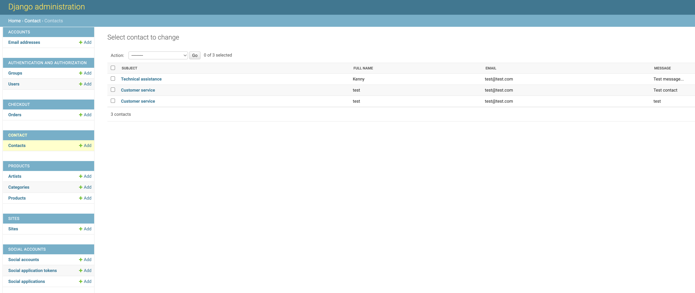

#### Product management:

For full CRUD functionality, the superuser can Create, Update, and Delete products directly from the site to manage products available for purchase. Any changes made on the site will be directly reflected to the user without having to use the Django admin panel.

##### Add product:

The Product management / Add product page can be accessed in the header section using the drop-down menu under My account name. The superuser will be able to add a new product to the site by filling in the Add a product form. If no image is selected here, a placeholder image will be displayed instead.

##### Edit product:

If the superuser wants to edit a specific product the Edit product page can be accessed using the Edit button on the Products or Product detail page. On the Edit a product page, the superuser will be able to update all product information including the image.

Products (superuser):

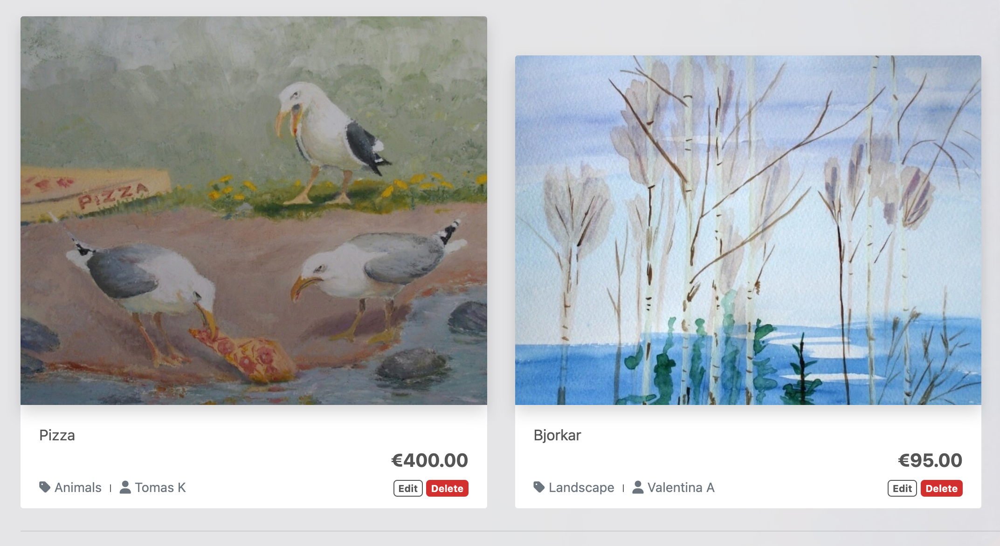

Product detail (superuser):

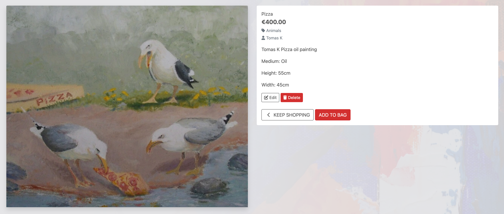

Edit product:

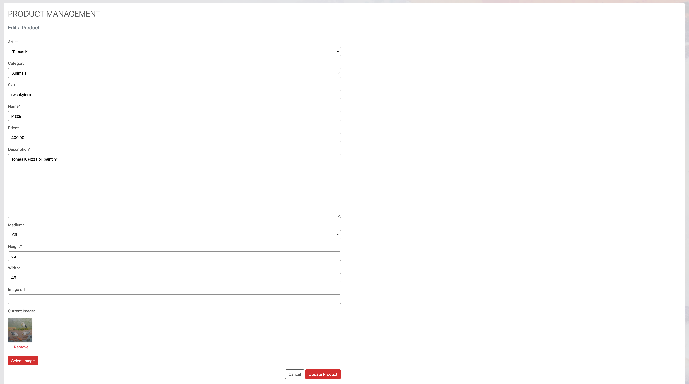

##### Delete product:

The Delete button is also displayed on the Products and Product detail page for each product.
If the superuser wants to delete a specific product they will have to confirm the deletion before the product is removed; a pop-up modal is displayed to the superuser with the option to Delete or Close.

Delete product modal:

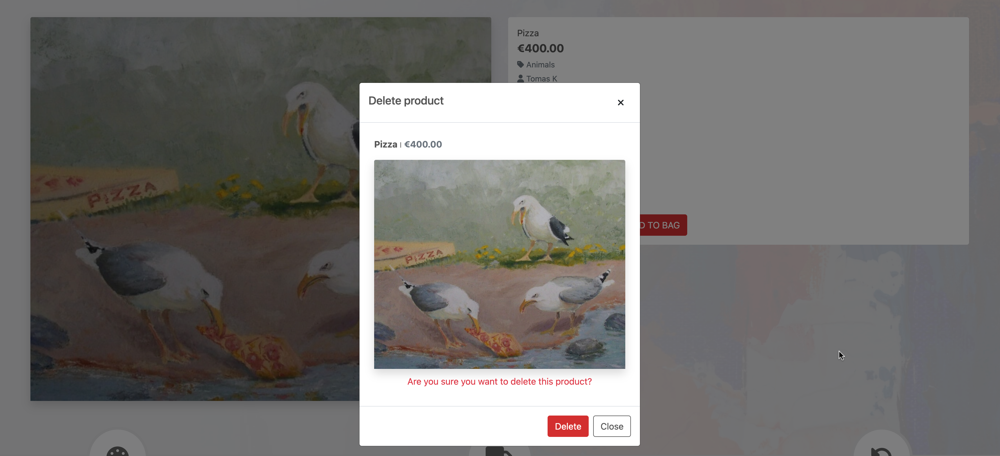

#### System Messages:

System / Flash messages are present throughout the site and will be displayed to the user as feedback. The message will appear at the top right of the screen when certain actions are completed and can easily be removed by manually clicking on the close x button.

System message when product added to bag:

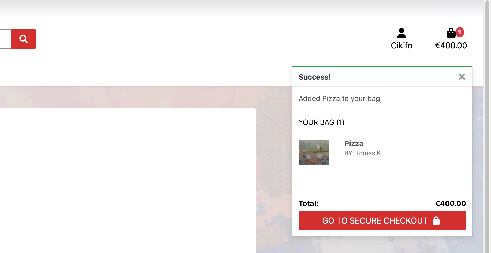

Alert message:

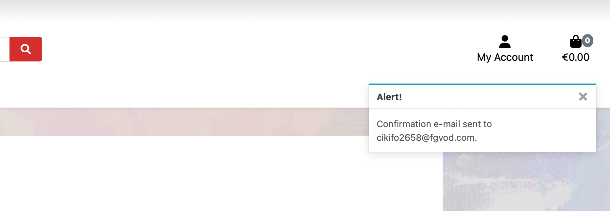

#### Featurette:

Positioned above the footer, the user is presented with three styled Font Awesome icons with text included; this will help the user to identify the purpose of the site and some of it’s features. The featurette is available on all pages of the site; on smaller devices the number of icons is reduced to two.

#### Footer:

The Footer is present on all pages of the site, featured at the absolute bottom. The footer contains links to Galleriet’s Facebook page, mittnamnkenny’s GitHub page, the Contact page, and the Privacy policy page. All External links open in a new tab.

An embedded Mailchimp newsletter form is also available in the footer. This will encourage users to subscribe to Galleriet’s newsletter.

Footer on mobile devices:

#### Web marketing:

##### Newsletter:

A user will be able to subscribe to Galleriet’s newsletter. The user is required to enter their email address and click on the Subscribe button to sign up. This will automatically add their email address to Galleriet’s subscription list. Newsletters can be sent out when new products are added to the store, as a part of the web marketing strategy for this project.

This service is handled by MailChimp.

[Mailchimp Website.](https://mailchimp.com/)

MailChimp Audience:

##### Facebook business page:

A Facebook business page was created for the purpose of web marketing. The footer contains a link to Galleriet’s Facebook page; Visit our Facebook page; this link will open in a new tab.

[Galleriet’s Facebook page.](https://www.facebook.com/people/Galleriet/100086925295277/)

Screenshot Galleriet’s Facebook page:

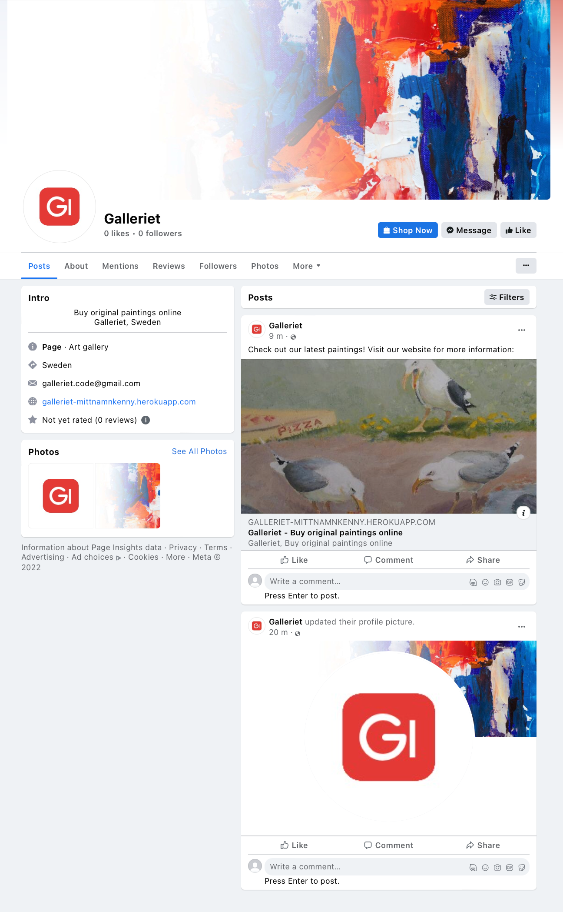

#### Privacy Policy:

A Privacy policy page was created and can be accessed by the link in the footer. The Privacy policy will show the user that this site is trustworthy and that Galleriet takes privacy seriously.

The privacy policy was created using:

[Privacy Policy Generator.](https://www.privacypolicygenerator.info/)

#### SEO:

To increase brand reach and make the site search-engine friendly, the following Search Engine Optimization (SEO) techniques were used:

##### Keyword research:

Keywords and phrases were identified using the site [Wordtracker](https://www.wordtracker.com/). I have also used the auto-complete feature of Google to get keyword ideas for my project.

A list of relevant keywords for my project: gallery, paintings, paintings online, artists, art, unique art, original paintings, art store.

I have used the following Keywords:

  - Home Callout h1: Buy original <strong>paintings</strong> online
  - Featurette h3: Quality paintings
  - Featurette p: From the best emerging artists around the world
  - Footer p: Keep up to date with all our latest paintings
  - Title tag: Galleriet - Buy original paintings online
  - Meta description: Galleriet, Buy original paintings online
  - Meta keywords: galleriet, gallery, paintings, paintings online, artists, art, unique art, original paintings, art store

Images on the site have descriptive alternative text 

A sitemap.xml file was created to allow search engine bot crawling

A robots.txt file was created to control search engine bot crawling

#### Additional features:

Favicon.

Most links and buttons will change colour when hovered over.

404 response page.

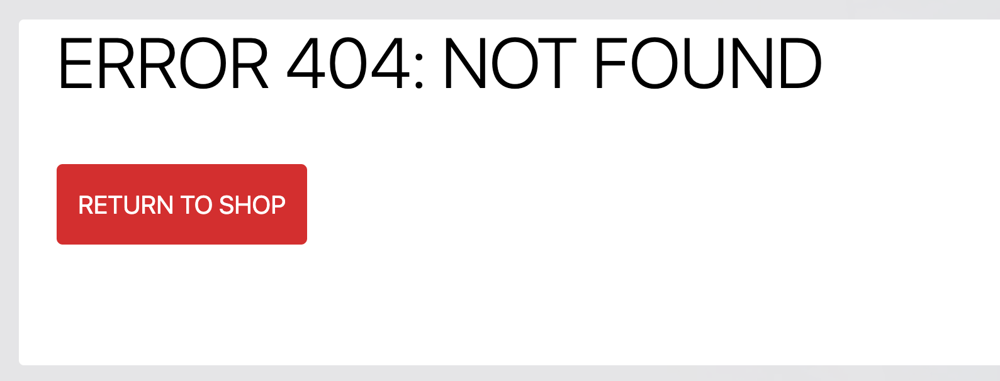

### Features that could be implemented in the future:

#### Product inventory:

This website is for educational purposes only, and currently a user will be able to purchase the same painting multiple times without it being removed from the list of available products.
This will guarantee that products are always available for test purchase to the user.

To solve this the following could be done in the future:

In the products app:
Update the product model and add a new field named available (IntegerField), that defaults to 1.
Update the all_products view to filter Product by available=1 instead of all.

In the checkout app:
Update the checkout view to first check if product is still available for purchase and when order form is valid, set product available to 0 and save.

## Design

### Wireframes

At the beginning of this project and as a part of the planning phase wireframes were created using [Balsamiq](https://balsamiq.com/). The wireframes were used to get a basic idea on how the site might look when finished, both on desktop and mobile devices.

Wireframes were created for the following pages and features:

#### Home page:

#### Products page:

#### Product detail page:

#### Shopping bag:

#### Checkout page:

#### Profile page:

#### Contact page:

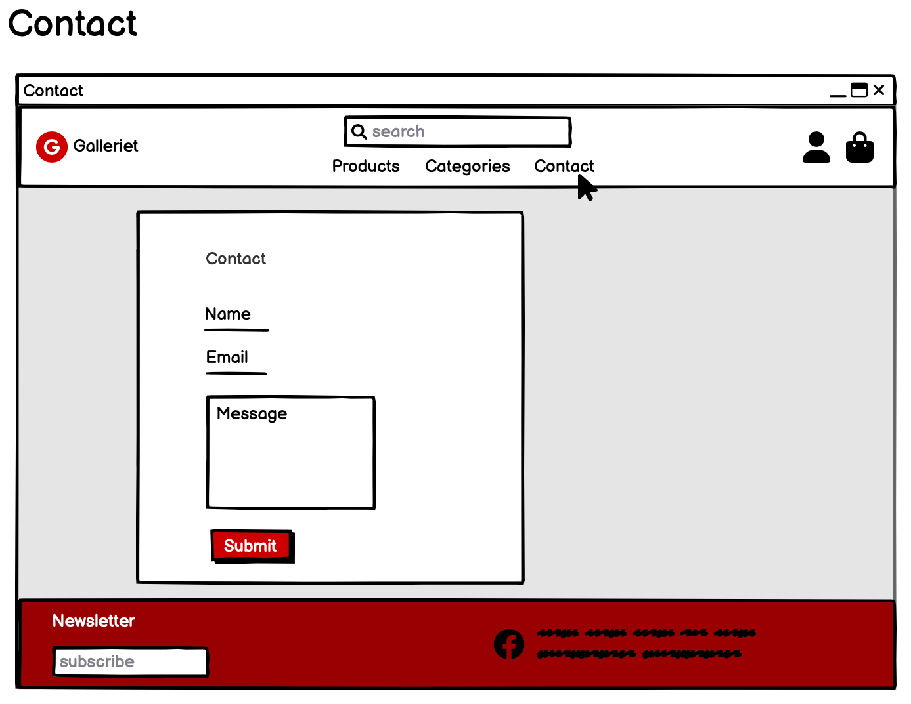

#### Mobile devices:

### Data Model

This project is hosted on [Heroku](https://www.heroku.com/) and the database used is Heroku PostgreSQL. 
[Amazon Web Services (AWS)](https://aws.amazon.com) is used to store all static files and images. 
This project is based on Code Institute's walkthrough project Boutique Ado, Building an E-Commerce Platform. 

Four custom models were created for this project; Product, Artist, Contact and OrderLineItem.

Entity Relationship Diagram - Product:

Entity Relationship Diagram - Artist:

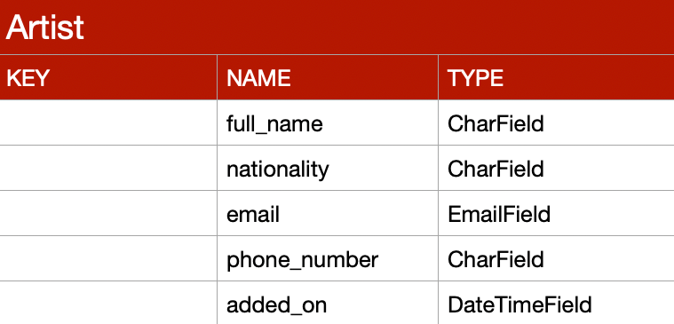

Entity Relationship Diagram - Contact:

Entity Relationship Diagram - OrderLineItem:

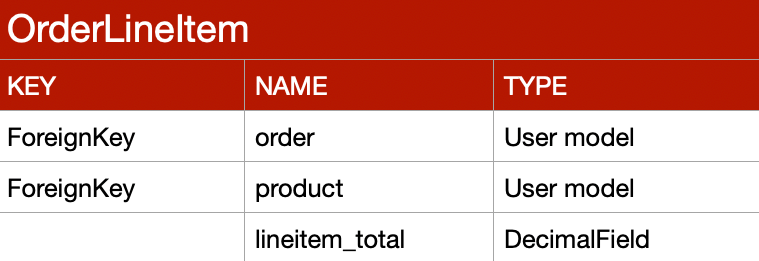

### Site map

To explain the structure of the site and how to navigate it, I created a site map using [Lucidchart](https://www.lucidchart.com/pages/):

### Colours

To match the background image featuring an abstract painting photo, red was chosen as the main colour to use throughout the site. The idea is to create a minimalist look and with a different colour scheme compared to my previous projects with Code Institute. [Google Materialize](https://materializecss.com/color.html) color palette was used to select the hex colour codes.

With a focus on accessibility and contrast, the following main colours were chosen:

### Typography

I have used font-family "Helvetica Neue", Helvetica, Arial, sans-serif for all of the text throughout the site. This is Bootstrap's default font, and this was chosen because it both looks good and is easy to read.

To make text catch the users attention and improve SEO, strong tags were used in the callout header.

### Imagery

Background image used in this project:

  - [Unsplash:](https://unsplash.com/photos/0YZekL_Kp2E) Abstract painting photo, Steve Johnson

Photoshop was used to adjust the brightness and add a gradient overlay, this will make the callout text stand out and more visible to the user.

All product images used in this project are real paintings created by mittnamnkenny’s family and friend. mittnamnkenny have full permission to use their paintings in this project.

  - [Tomas K:](https://galleri.black/flyfishing/) Tomas K Galleri

## Technologies Used

### Languages Used:

  - HTML5
  - CSS3
  - JavaScript
  - Python

### Python packages Used:

    asgiref==3.5.2
    boto3==1.24.96
    botocore==1.27.96
    dj-database-url==0.5.0
    Django==3.2
    django-allauth==0.41.0
    django-countries==7.2.1
    django-crispy-forms==1.14.0
    django-storages==1.9.1
    gunicorn==20.0.4
    jmespath==1.0.1
    oauthlib==3.2.1
    Pillow==9.2.0
    psycopg2-binary==2.8.6
    python3-openid==3.2.0
    pytz==2022.2.1
    requests-oauthlib==1.3.1
    s3transfer==0.6.0
    sqlparse==0.4.3
    stripe==4.2.0

### Frameworks, Libraries and Software Used:

  - [Am I Responsive:](http://ami.responsivedesign.is) Checking the responsive.
  - [Amazon Web Services (AWS)](https://aws.amazon.com) Used to store all static files and images.
  - [Balsamiq:](https://balsamiq.com/) Used to create the wireframes.  
  - [Bootstrap:](https://getbootstrap.com/) Bootstrap CSS Framework used for styling and to build responsive web pages.
  - [Chrome DevTools:](https://developer.chrome.com/docs/devtools/) Used to test the response on different screen sizes, debugging and to generate a Lighthouse report to analyze page load.  
  - [Django:](https://www.djangoproject.com/) Main Python framework used in the development.
  - [Font Awesome:](https://fontawesome.com/) Used throughout the site to add icons for aesthetic and UX purposes.
  - [Git:](https://git-scm.com/) Git was used for version control by utilizing the Gitpod terminal to commit to Git and Push to GitHub.
  - [GitHub:](https://github.com/) GitHub is used to store the projects code after being pushed from Git and to create the Kanban board used for this project.
  - [Gmail:](https://www.google.com/intl/sv/gmail/about/) Galleriet's main mail account.
  - [Heroku:](https://www.heroku.com/) For deployment and hosting of the application.
  - [Heroku PostgreSQL:](https://www.heroku.com/postgres) The database used for this application.
  - [HTML Validator:](https://validator.w3.org/) Check your code for HTML validation.
  - [JSHint:](https://jshint.com/) Check code for JavaScript validation.
  - [jQuery:](https://jquery.com/) JavaScript library.  
  - [Lucidchart:](https://www.lucidchart.com/pages/) Used to create the site map.
  - [Mailchimp:](https://mailchimp.com/) Newsletter service.
  - [Materialize Colors:](https://materializecss.com/color.html) Used to create the main colour palette.
  - [Photoshop:](https://www.adobe.com/se/products/photoshop.html) Used to customize the callout image, adjust brightness and add gradient overlay.
  - [Stripe:](https://stripe.com/se) Online payment processing system.
  - [Temp Mail:](https://temp-mail.org/en/) Used for account registration, newsletter sign up and test purchases.
  - [Tiny PNG:](https://tinypng.com/) Compressing images to smaller sizes.
  - [Unsplash:](https://unsplash.com/photos/0YZekL_Kp2E) Abstract painting photo, Steve Johnson
  - [W3 CSS Validator:](https://jigsaw.w3.org/css-validator/) Check your code for CSS validation.
  - [Writer:](https://writer.com/grammar-checker/) Free Grammar Check.

